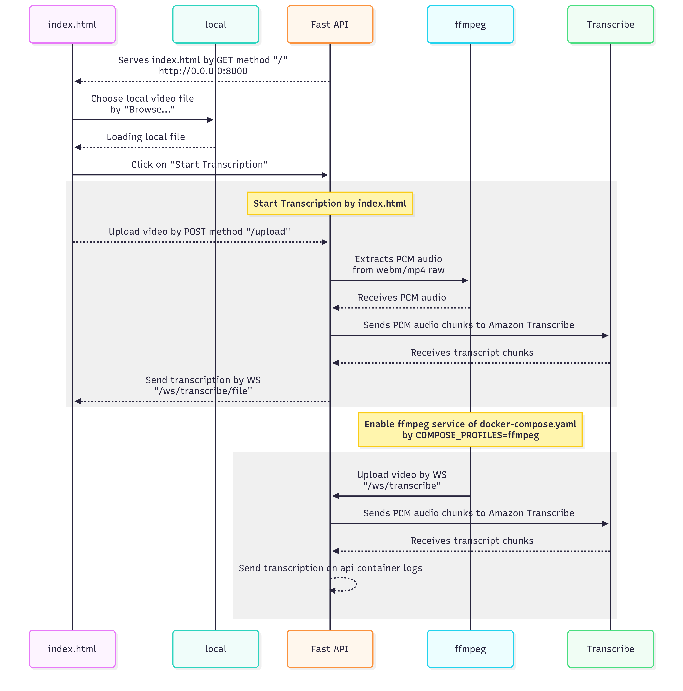
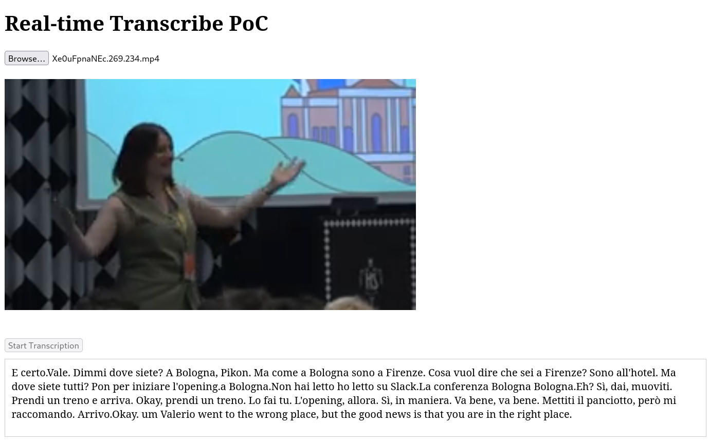
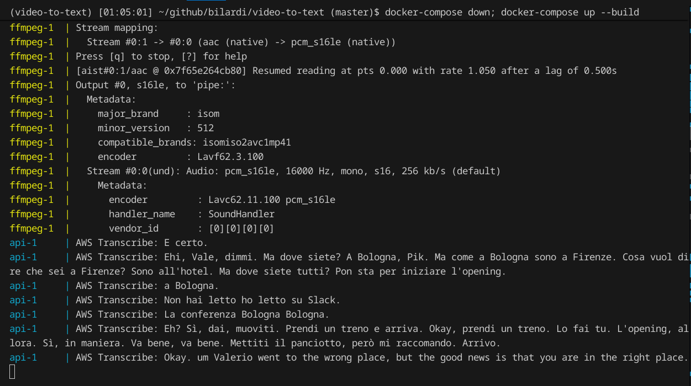

# Video to Text

Real-time video transcription PoC using **Amazon Transcribe Streaming**, **FastAPI**, and **ffmpeg**.

## How it works

Upload a local video file via the web UI. The backend extracts the audio with ffmpeg, streams it to Amazon Transcribe, and returns the transcription in real time to the browser.

```
Browser  →  POST /upload          →  saves video to /tmp
Browser  →  WS /ws/transcribe/file →  ffmpeg extracts PCM audio → Amazon Transcribe → text back to browser
```

## Project structure

```
├── docker-compose.yaml       # defines the `api` service (and optional `ffmpeg` simulator)
├── Dockerfile_app            # Python 3.13 + ffmpeg + pip dependencies
├── Dockerfile_ffmpeg         # Alpine + ffmpeg + websocat (for CLI-based testing)
└── app/
    ├── __init__.py           # makes app/ a Python package
    ├── main.py               # FastAPI app: serves index.html, /upload endpoint, WebSocket endpoints
    ├── transcribe_service.py # wraps Amazon Transcribe Streaming SDK
    ├── requirements.txt      # Python dependencies
    └── index.html            # single-page UI: video player + file upload + live transcript
```

### File responsibilities

- **`main.py`**: exposes the following endpoints. HTTP endpoints are documented interactively via Swagger UI at [http://localhost:8000/docs](http://localhost:8000/docs). WebSocket endpoints are not shown in Swagger (not supported by OpenAPI) but are documented below.

  | Method | Path | Description |
  |--------|------|-------------|
  | `GET` | `/` | Serves `index.html` |
  | `POST` | `/upload` | Accepts a video file, saves it to `/tmp/<filename>`, returns `{"path": "/tmp/<filename>"}` |
  | `WS` | `/ws/transcribe` | Receives raw PCM binary chunks (e.g. from the ffmpeg container), streams them to Amazon Transcribe, sends back transcript text frames |
  | `WS` | `/ws/transcribe/file` | Receives a server-side file path as the first text frame, runs ffmpeg internally to extract PCM audio, streams it to Amazon Transcribe, sends back transcript text frames |
- **`transcribe_service.py`**: opens a streaming session with Amazon Transcribe, sends audio chunks, and fires a callback for each final transcript segment.
- **`index.html`**: lets the user pick a local video file, previews it, uploads it, and displays the transcription as it arrives over WebSocket.

### Diagram

The diagram was created with [diagram.mermaid](./docs/diagram.mermaid) on https://mermaid.ai/



## Prerequisites

### AWS credentials

This project uses your local AWS credentials via `~/.aws`. Make sure you have configured them with a profile that has permission to call `TranscribeStreaming`:

```sh
aws configure --profile <your-profile>
```

See the [AWS CLI configuration guide](https://docs.aws.amazon.com/cli/latest/userguide/cli-configure-files.html) for details.

The required IAM permission is `transcribe:StartStreamTranscription`.

## Development

Environment installation

```sh
pip install uv
uv python install 3.13
uv venv --python 3.13
```

Environment usage

```sh
source .venv/bin/activate
uv pip install -r app/requirements.txt -r tests/requirements-test.txt
```

Test tools in the environment

```sh
uv run pytest
uv run black app/ tests/
uv run pylint app/
```

Versioning management

```sh
# use one of the following commands according to the guide https://semver.org/
make patch
make minor
make major
```

## Usage

```sh
# Set environment variables
export AWS_PROFILE=your-profile
export AWS_REGION=eu-west-1
export COMPOSE_PROFILES=index.html

# Write .env for docker-compose
cat << EOF > .env
AWS_PROFILE=$AWS_PROFILE
AWS_REGION=$AWS_REGION
COMPOSE_PROFILES=$COMPOSE_PROFILES
EOF

# Build and start
docker-compose down; docker-compose up --build
```

Then open [http://localhost:8000](http://localhost:8000) in your browser:

1. Click **Choose File** and select a local video file
2. The video will appear in the player
3. Click **Start Transcription** — the transcript will appear in real time below the player

## CLI-based testing (optional)

To test without the browser UI, by `ffmpeg` service of `docker-compose.yaml`, set `COMPOSE_PROFILES` and `VIDEO_FILE`:

```sh
# Set environment variables
export AWS_PROFILE=your-profile
export AWS_REGION=eu-west-1
export COMPOSE_PROFILES=ffmpeg
export VIDEO_FILE=/tmp/tests/your-video.mp4

# Write .env for docker-compose
cat << EOF > .env
AWS_PROFILE=$AWS_PROFILE
AWS_REGION=$AWS_REGION
COMPOSE_PROFILES=$COMPOSE_PROFILES
VIDEO_FILE=$VIDEO_FILE
EOF

docker-compose down; docker-compose up --build
```

This streams the video directly to the `WS /ws/transcribe` endpoint. Transcription output appears in the `api` container logs.

## Examples

### Download video

```sh
## Download opening video of PyCon IT 2025 ##
# Formats list
yt-dlp -F https://www.youtube.com/watch?v=Xe0uFpnaNEc
# Best audio ID 234, small video ID 269
yt-dlp -f 269+234 --merge-output-format mp4 -o "tests/Xe0uFpnaNEc.269.234.mp4" https://www.youtube.com/watch?v=Xe0uFpnaNEc
```

### GUI test

```sh
## Configure environment variables ##
# Set environment variables
export AWS_PROFILE=mine
export AWS_REGION=eu-west-1
export COMPOSE_PROFILES=index.html

# Write .env for docker-compose
cat << EOF > .env
AWS_PROFILE=$AWS_PROFILE
AWS_REGION=$AWS_REGION
COMPOSE_PROFILES=$COMPOSE_PROFILES
EOF

## GUI test
# Build and start
docker-compose down; docker-compose up --build

# Open http://0.0.0.0:8000
# Choose the file downloded
# Click Start Transcription
```



### CLI test

```sh
## Configure environment variables ##
# Set environment variables
export AWS_PROFILE=mine
export AWS_REGION=eu-west-1
export COMPOSE_PROFILES=ffmpeg
export VIDEO_FILE=/tmp/tests/Xe0uFpnaNEc.269.234.mp4

# Write .env for docker-compose
cat << EOF > .env
AWS_PROFILE=$AWS_PROFILE
AWS_REGION=$AWS_REGION
COMPOSE_PROFILES=$COMPOSE_PROFILES
VIDEO_FILE=$VIDEO_FILE
EOF

## CLI test
# Build and start
docker-compose down; docker-compose up --build
```


